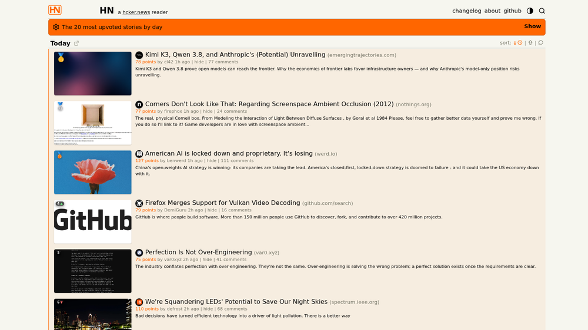

# visual.hcker.news

Visual-HN with preview images/Open Graph metadata, descriptions, zoom, position trends, and more — a FastAPI proxy that enriches [hcker.news](https://hcker.news) (itself a [Hacker News](https://news.ycombinator.com/) clone) stories with Open Graph imagery and metadata, then serves them to a browser extension that overlays the feed.

**Live:** [hn.is-ai-good-yet.com](https://hn.is-ai-good-yet.com)



## Features

### Proxy & enrichment backend

- ✅ Proxies the hcker.news homepage and injects preview assets into the response
- ✅ Fetches Open Graph metadata (`og:image`, `og:description`) for every story
- ✅ Downloads and resizes images to a consistent 16:9 thumbnail (max 640px JPEG)
- ✅ Multi-layer anti-scraping pipeline: `curl_cffi` TLS fingerprinting → residential headful Chromium → Wayback Machine → screenshot → favicon composite
- ✅ Tracks each story's position trend over time (rising / falling / steady)
- ✅ Exposes story metadata and image assets through the Visual-HN API
- ✅ Async SQLite persistence via SQLAlchemy + aiosqlite

### Browser extension (`visual-hn-previews/`)

- ✅ 16:9 story thumbnail beside every headline
- ✅ Source favicon before the title
- ✅ Open Graph / meta description line under the title
- ✅ Hover preview card
- ✅ Click-to-open lightbox with zoom controls
- ✅ On-site toggle + thumbnail size control
- ✅ Keyboard shortcuts: <kbd>I</kbd> toggles thumbnails, <kbd>Esc</kbd> closes the lightbox
- ✅ Dedupe-safe and idempotent for infinite scroll and client-side navigation
- ✅ Gracefully hides missing or broken images
- ✅ Settings sync via `chrome.storage.sync` and apply live

## Tech Stack

- **Backend:** Python 3.10+, FastAPI, SQLAlchemy, aiosqlite, aiohttp, curl_cffi
- **Scraping:** curl_cffi (TLS fingerprint impersonation), BeautifulSoup4, Pillow, Playwright
- **Frontend:** Proxied hcker.news runtime; legacy HTML/Tailwind page (retired)
- **Database:** SQLite with async access

## Setup

> The proxy/scraper runs on Ubuntu. See [`docs/DEPLOYMENT.md`](docs/DEPLOYMENT.md) for the full operational guide. Commands below are VPS-only (Ubuntu/bash).

```bash
git clone https://github.com/ilyaizen/visual-hn.git
cd visual-hn
python -m venv .venv
source .venv/bin/activate
pip install -r requirements.txt
uvicorn main:app --reload
```

Open `http://localhost:8000`.

### Browser extension

Load `visual-hn-previews/` unpacked:

1. Open `chrome://extensions`
2. Enable **Developer mode**
3. Click **Load unpacked**
4. Select the `visual-hn-previews/` directory
5. Open [hcker.news](https://hcker.news/)

See [`visual-hn-previews/README.md`](visual-hn-previews/README.md) for extension settings, keyboard shortcuts, and dev tests.

## Project Structure

| File                     | Purpose                                       |
| ------------------------ | --------------------------------------------- |
| `main.py`                | FastAPI app, routes, lifespan setup           |
| `hcker_proxy.py`         | hcker.news proxy with preview asset injection |
| `hn_scraper.py`          | Fetches top stories from the HN Firebase API  |
| `metadata.py`            | Open Graph parsing, image download/resize     |
| `database.py`            | Async persistence, trend calculation          |
| `residential_fetcher.py` | Headful Chromium fallback (residential node)  |
| `filter_lists.py`        | Content-blocker filter list compilation       |
| `models.py`              | SQLAlchemy ORM models                         |
| `templates/`             | Legacy HTML templates                         |
| `static/`                | CSS, images, favicon                          |
| `visual-hn-previews/`    | Chrome/Edge extension for hcker.news          |
| `scripts/`               | Residential-fetcher service + watchdog (Win)  |
| `docs/`                  | Deployment, node setup, rebrand runbooks      |

## Contributing

Contributions are welcome. Current focus is the hcker.news proxy, preview assets, and the Visual-HN API.

## License

MIT
